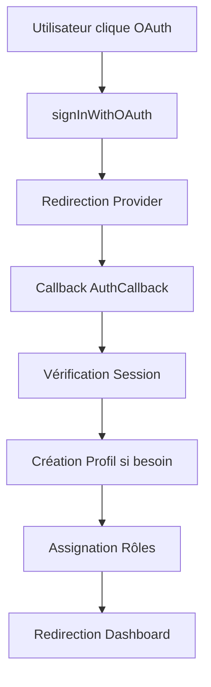

# Documentation Technique - Implémentation OAuth pour Mon Toit

## 📋 Vue d'ensemble

Ce document décrit l'implémentation complète de l'authentification OAuth pour la plateforme Mon Toit, permettant aux utilisateurs de se connecter via Google, Facebook, Apple et Microsoft.

## 🏗️ Architecture Technique

### Fichiers Principaux

```
src/
├── hooks/
│   └── useAuthEnhanced.tsx          # Hook d'authentification amélioré avec OAuth
├── components/auth/
│   └── OAuthButtons.tsx            # Composant réutilisable pour les boutons OAuth
├── lib/
│   └── oauth-config.ts             # Configuration des providers OAuth
├── pages/
│   ├── Auth.tsx                    # Page d'authentification mise à jour
│   └── AuthCallback.tsx            # Page de callback OAuth
└── App.tsx                         # Routage avec callback OAuth
```

### Flux d'Authentification



## 🔧 Configuration des Providers

### 1. Google OAuth

**Configuration Supabase :**
1. Console Supabase → Authentication → Providers
2. Activer Google provider
3. Ajouter Client ID et Client Secret
4. Callback URL: `https://votredomaine.com/auth/callback`

**Paramètres :**
```typescript
{
  name: 'google',
  scopes: ['email', 'profile'],
  queryParams: {
    access_type: 'offline',
    prompt: 'consent'
  }
}
```

### 2. Facebook OAuth

**Configuration Facebook Developers :**
1. Créer une app sur https://developers.facebook.com
2. Ajouter "Facebook Login" product
3. Configurer OAuth Redirect URIs
4. Activer provider dans Supabase

**Paramètres :**
```typescript
{
  name: 'facebook',
  scopes: ['email', 'public_profile']
}
```

### 3. Apple OAuth

**Configuration Apple Developer :**
1. Compte Apple Developer requis
2. Activer "Sign In with Apple"
3. Configurer les domaines autorisés
4. Activer provider dans Supabase

**Paramètres :**
```typescript
{
  name: 'apple',
  scopes: ['email', 'name']
}
```

### 4. Microsoft OAuth

**Configuration Azure Portal :**
1. Créer une app dans Azure Portal
2. Configurer l'authentification
3. Ajouter les redirect URIs
4. Activer provider "azure" dans Supabase

**Paramètres :**
```typescript
{
  name: 'azure', // Supabase utilise 'azure' pour Microsoft
  scopes: ['email', 'profile']
}
```

## 📱 Utilisation du Composant OAuthButtons

### Importation

```typescript
import OAuthButtons from '@/components/auth/OAuthButtons';
```

### Utilisation de base

```typescript
<OAuthButtons
  userType="proprietaire"
  className="mt-4"
  variant="outline"
  size="default"
/>
```

### Props disponibles

| Prop | Type | Default | Description |
|------|------|---------|-------------|
| `userType` | `'locataire' \| 'proprietaire' \| 'agence'` | `'proprietaire'` | Type d'utilisateur pour l'inscription |
| `className` | `string` | `''` | Classes CSS additionnelles |
| `variant` | `'default' \| 'outline' \| 'ghost'` | `'outline'` | Variante du bouton |
| `size` | `'default' \| 'sm' \| 'lg' \| 'icon'` | `'default'` | Taille des boutons |

## 🔒 Gestion de la Sécurité

### Validation des Données

La page `AuthCallback.tsx` effectue plusieurs vérifications :

1. **Validation du code OAuth** : Vérifie la présence du code d'autorisation
2. **Création automatique du profil** : Crée un profil si inexistant
3. **Assignation des rôles** : Attribue le rôle par défaut approprié
4. **Nettoyage des données** : Échappe et valide toutes les entrées

### Permissions RLS

Les politiques RLS (Row Level Security) s'appliquent automatiquement aux utilisateurs OAuth :

```sql
-- Exemple de politique RLS pour les profils
CREATE POLICY "Users can view own profile" ON profiles
  FOR SELECT USING (auth.uid() = id);
```

## 🔄 Cycle de Vie OAuth

### 1. Initialisation

```typescript
const { signInWithOAuth } = useAuth();

// Connexion avec Google
const { error } = await signInWithOAuth('google', 'proprietaire');
```

### 2. Redirection

L'utilisateur est redirigé vers le provider OAuth avec les paramètres :
- `redirect_uri`: URL de callback
- `scope`: Permissions demandées
- `response_type`: 'code'
- `state`: Token CSRF

### 3. Callback

Le provider redirige vers `/auth/callback` avec :
- `code`: Code d'autorisation
- `state`: Token CSRF pour validation

### 4. Échange du Token

Supabase échange le code contre un access token et crée la session.

### 5. Création du Profil

```typescript
// Vérification et création du profil
const { data: existingProfile } = await supabase
  .from('profiles')
  .select('*')
  .eq('id', user.id)
  .single();

if (!existingProfile) {
  await supabase.from('profiles').insert({
    id: user.id,
    full_name: user.user_metadata?.full_name || user.email?.split('@')[0],
    user_type: userType,
    avatar_url: user.user_metadata?.avatar_url,
    email: user.email
  });
}
```

## 🎨 Personnalisation

### Ajouter un Nouveau Provider

1. **Mettre à jour `oauth-config.ts` :**

```typescript
export const OAUTH_CONFIG = {
  // ... providers existants
  github: {
    name: 'github',
    displayName: 'GitHub',
    scopes: ['user:email'],
    queryParams: {},
    icon: 'Github',
    color: 'hover:bg-gray-50 hover:border-gray-300 hover:text-gray-700',
    label: 'Continuer avec GitHub',
  }
} as const;
```

2. **Mettre à jour le type :**

```typescript
export type OAuthProvider = keyof typeof OAUTH_CONFIG;
```

3. **Configurer dans Supabase :**
   - Activer le provider dans la console
   - Ajouter les credentials

### Personnalisation des Boutons

Le composant `OAuthButtons` peut être personnalisé :

```typescript
// Style personnalisé
<OAuthButtons
  className="custom-oauth-buttons"
  variant="ghost"
  size="lg"
/>

// Avec un callback personnalisé
const handleOAuthSuccess = (provider: string) => {
  analytics.track('oauth_signin', { provider });
};
```

## 📊 Monitoring et Logging

### Logs d'Erreur

Les erreurs OAuth sont automatiquement loggées :

```typescript
logger.error('OAuth sign in error', {
  provider,
  error: error.message,
  email: user.email
});
```

### Métriques

Utilisez les logs pour suivre :
- Taux de succès par provider
- Erreurs fréquentes
- Temps de connexion

## 🚨 Dépannage

### Erreurs Communes

1. **"OAuth provider not configured"**
   - Solution: Configurer le provider dans la console Supabase

2. **"Invalid redirect URI"**
   - Solution: Ajouter l'URL exacte dans la configuration du provider

3. **"No session found"**
   - Solution: Vérifier la configuration du callback URL

4. **"Profile creation failed"**
   - Solution: Vérifier les permissions RLS sur la table `profiles`

### Debug Mode

Pour activer le debug :

```typescript
// Dans .env.local
VITE_LOG_LEVEL=debug
```

## 🔮 Évolutions Futures

### Roadmap

1. **Support additionnel** : LinkedIn, Twitter
2. **OAuth 2.0 PKCE** : Sécurité renforcée
3. **SAML SSO** : Pour les entreprises
4. **Analytics avancés** : Dashboard de monitoring OAuth

### Tests

```typescript
// Tests unitaires exemple
describe('OAuthButtons', () => {
  it('should render all providers', () => {
    render(<OAuthButtons />);
    expect(screen.getByText('Continuer avec Google')).toBeInTheDocument();
  });
});
```

## 📞 Support

Pour toute question sur l'implémentation OAuth :

1. Vérifier la documentation Supabase Auth
2. Consulter les logs dans la console Supabase
3. Vérifier la configuration des providers
4. Tester avec le debug mode activé

---

**Version :** 1.0.0
**Dernière mise à jour :** 22/10/2024
**Auteur :** Claude Code Assistant